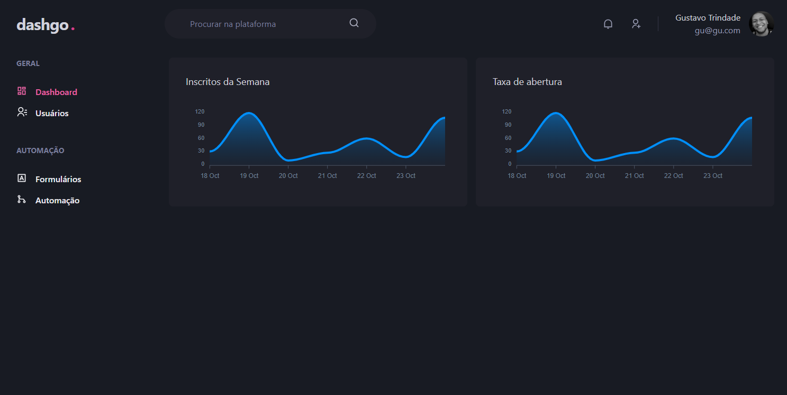

# **Dash.go**



> Aplicação dashboard feita para gerenciar dados de usuários, servindo como boilerplate de CRM responsiva, escalável e adaptável as novas stacks Next.

#

### O projeto ainda não chegou ao fim em suas tarefas:

- [x] Exportar layout da aplicação do figma
- [x] Estilizar usando ChakraUi
- [x] Criar página Sign-in
- [x] Criar Components de Sign-in
- [x] Criar página Dashboard
- [x] Criar Components de Dashboard
- [x] Criar página Users | List
- [x] Criar Components de Users | List
- [x] Criar página User | Form
- [x] Configurar responsividade
- [ ] Configurar Formulário de criação de usuários

#

## 💻 Pré-requisitos

Antes de começar, verifique os seguintes requisitos:

- Requer versões:  

```
rodando com versões atualizadas
```

## 🚀 Instalando **daashgo**

Para instalar o **dashgo**, siga estas etapas:

Win, Linux e macOS:

```
npm i
or
yarn
```

to Run app:

```
npm run dev
or
yarn dev
```

#

## 🫱🏻‍🫲🏽 Instrutores

Agradeço às seguintes pessoas que contribuíram para este projeto:

<table>
  <tr>
    <td align="center">
      <a href="#">
        <br>
        <sub>
          <b>Diego Fernandes</b>
        </sub>
      </a>
    </td>
    <td align="center">
      <a href="#">
        <br>
        <sub>
          <b>Mayk Brito</b>
        </sub>
      </a>
    </td>
    <td align="center">
      <a href="#">
        <br>
        <sub>
          <b>Jakeliny Gracielly</b>
        </sub>
      </a>
    </td>
  </tr>
</table>

[⬆ Voltar ao topo](#nome-do-projeto)<br>
